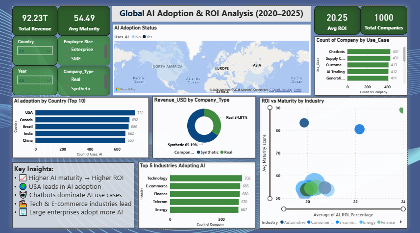

# Global-AI-Adoption-ROI-Analysis-2020-2025
Analysis of AI adoption, ROI and maturity across 1000 companies (2020–2025)
# 📊 AI Adoption & ROI Analysis (2020–2025)

## 📌 Project Overview
This project analyzes AI adoption across 1000 companies between 2020 and 2025.  
The dataset contains 6000+ records covering industries, countries, company types, AI maturity, and ROI.

The goal is to understand how AI adoption impacts business performance.

---

## 🎯 Objectives
- Analyze AI adoption trends
- Identify top AI use cases
- Compare ROI vs AI maturity
- Evaluate industry-wise AI adoption

---

## 📂 Dataset
- 6000+ rows  
- 1000 companies  
- Features: Country, Industry, Company Type, AI ROI, AI Maturity  

🔗 Source: ([Paste Kaggle link here)
](https://www.kaggle.com/datasets/abidhussai512/ai-adoption-in-fortune-500-companies-20202025)
---

## 🛠 Tools Used
- Excel  
- Power BI  

---

## 📷 Dashboard Preview

---

## 📊 Key Insights
- 📈 Higher AI maturity leads to higher ROI  
- 🌍 USA leads in AI adoption  
- 🤖 Chatbots & Supply Chain are most used  
- 🏭 Tech & E-commerce industries lead  
- 🏢 Large enterprises adopt more AI  

---

## 📁 Files
- `data.xlsx` → Dataset  
- `dashboard.pbix` → Power BI dashboard  
- `images/dashboard.png` → Screenshot  

---

## 🚀 Conclusion
AI adoption is increasing rapidly, and companies with higher maturity achieve better ROI.

---

## 🙌 Author
Roma Kannojia | 9305484503 | kannojia.roma8@gmail.com
